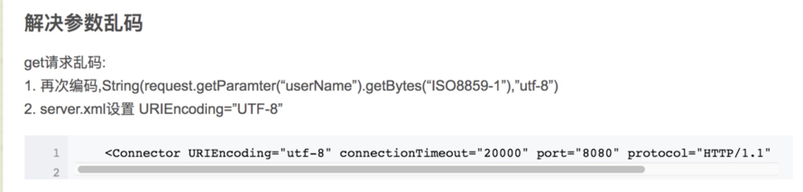

## javaWeb 总结
参考cnblogs 孤傲苍狼 的博客[JavaWeb学习总结](http://www.cnblogs.com/xdp-gacl/tag/JavaWeb%E5%AD%A6%E4%B9%A0%E6%80%BB%E7%BB%93/default.html?page=3)

### tomcat
- 
- [配置https](http://www.cnblogs.com/xdp-gacl/p/3744053.html)
    - 生成服务器证书
        - keytool -genkey -alias tomcat -keyalg RSA
        ```s1
            输入密钥库口令:123456
            再次输入新口令:
            您的名字与姓氏是什么?
              [Unknown]:  xueleixi
            您的组织单位名称是什么?
              [Unknown]:  xueleixi
            您的组织名称是什么?
              [Unknown]:  xueleixi
            您所在的城市或区域名称是什么?
              [Unknown]:  xueleixi
            您所在的省/市/自治区名称是什么?
              [Unknown]:  xueleixi
            该单位的双字母国家/地区代码是什么?
              [Unknown]:  xueleixi
            CN=xueleixi, OU=xueleixi, O=xueleixi, L=xueleixi, ST=xueleixi, C=xueleixi是否正确?
              [否]:  y
            
            输入 <tomcat> 的密钥口令
                (如果和密钥库口令相同, 按回车):
        ```
        
        - 查看证书 keytool -list -keystore ~/.keystore

### servlet
- 线程安全问题

### get参数乱码问题

        